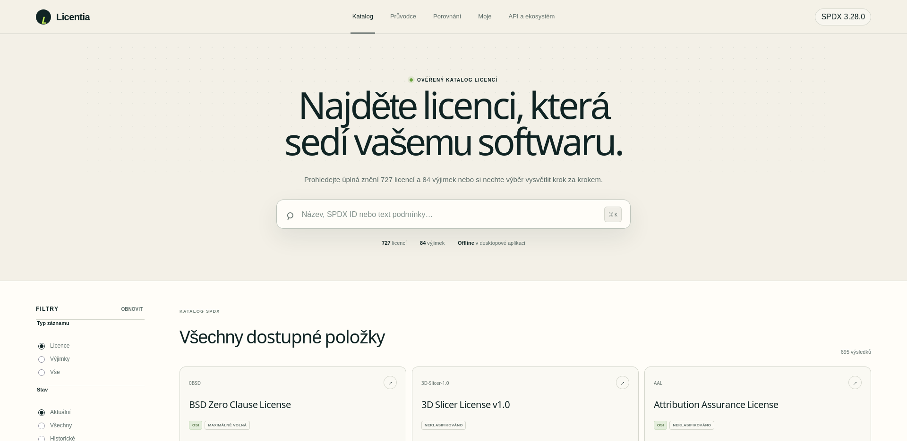
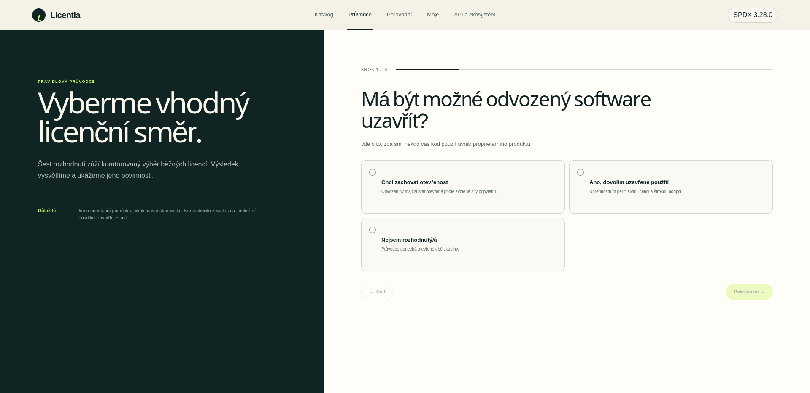
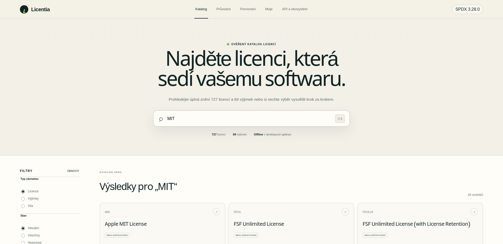

# Licentia

Licentia je česká webová a desktopová aplikace pro práci s katalogem SPDX License List 3.28.0. Pomáhá rychle najít licenci, porovnat její metadata a zorientovat se v povinnostech bez nutnosti procházet stovky textů ručně.

> Průvodce je orientační rozhodovací pomůcka, nikoli právní rada.

## Co umí

- offline katalog 727 licencí a 84 licenčních výjimek;
- plnotextové vyhledávání podle názvu, SPDX ID i úplného znění;
- filtrování podle typu záznamu, aktuálnosti, OSI/FSF metadat a profilu licence;
- detailní zobrazení kanonického textu a povinností;
- porovnání licencí a ukládání položek do osobního pracovního prostoru;
- průvodce výběrem s rychlým a rozšířeným režimem a povinnou kontrolou závislostí pro distribuované aplikace;
- veřejné REST API `/v1`;
- Streamable HTTP MCP endpoint `/mcp`;
- validaci SPDX výrazů, orientační kontrolu kompatibility a analýzu SPDX/CycloneDX SBOM;
- webovou, Tauri desktopovou a sdílenou Apache/PHP variantu.

## Ukázky aplikace

### Katalog licencí



### Průvodce výběrem



### Vyhledávání v katalogu



## Vývoj webové aplikace

Požadovaný Node.js: `>=22.13.0`.

```bash
npm install
npm run dev
```

Produkční sestavení:

```bash
npm run build
```

Úplná kontrola typů, stylu, datových smluv a testů:

```bash
npm run check
```

Bezpečnostní kontrola CI spouští také `npm audit --audit-level=high`. Dočasný
override `miniflare > sharp` v `package.json` vynucuje opravenou řadu `^0.35.4`,
protože používaný Miniflare připíná starší zranitelnou verzi. Důvodem je
[GHSA-rgj7-g3m4-5g8c](https://github.com/advisories/GHSA-rgj7-g3m4-5g8c);
override lze odstranit, až Miniflare sám přejde na opravenou závislost.

## Desktop: Linux, Windows a macOS

Desktop používá Tauri 2 a samostatnou statickou Vite sestavu se stejnými React komponentami a lokální kopií všech dat.

```bash
npm run dev:desktop
npm run tauri:dev
npm run tauri:build
```

Na Linuxu lze sestavit ověřené balíčky bez aktuálně problematického AppImage kroku příkazem `npm run tauri:build -- --bundles deb,rpm`. Release workflow používá tuto variantu, protože upstream balicí nástroj Tauri 2.11 může při tvorbě AppImage zůstat bez výstupu viset.

Instalátory se sestavují na cílovém systému. Linux potřebuje WebKitGTK 4.1, macOS Xcode Command Line Tools a Windows Microsoft C++ Build Tools plus WebView2. Přesné aktuální požadavky jsou v [oficiální dokumentaci Tauri](https://v2.tauri.app/start/prerequisites/).

## Sdílený Apache hosting

Požadavky: Apache 2.4 s `mod_rewrite`, HTTPS, PHP 8.2+, rozšíření PDO SQLite (nebo PDO MySQL), cURL a JSON.

```bash
npm run build:apache
```

Výsledný adresář `apache-dist/` nahrajte do kořene webu. Vždy zkopírujte `api/config.example.php` jako `api/config.php`, nastavte přesnou veřejnou HTTPS adresu (`base_url`), dlouhý náhodný `rate_limit_secret` a cestu pro relace a SQLite databázi mimo veřejný kořen. OAuth klíče jsou volitelné. Callback je:

```text
https://vase-domena.cz/api/auth/oauth/callback
```

Bez OAuth konfigurace fungují účty přes e-mail a heslo. Nadřazené adresáře databáze a relací musí existovat a být zapisovatelné pouze pro PHP proces; aplikace úmyslně odmítne konfiguraci uvnitř veřejného webového kořene.

Přihlašovací a registrační obrazovka nabízí také volitelnou cestu „Pokračovat bez registrace a přihlášení“. Účetní funkce zůstávají k dispozici; stav anonymního pracovního prostoru se ukládá pouze v `localStorage` prohlížeče a nepersistuje se na serveru ani k účtu.

Po nahrání ověřte `/v1`, `/v1/openapi.json`, `/v1/licenses?q=MIT`, zahájení
průvodce přes `POST /v1/guide` a MCP inicializaci přes `POST /mcp`. Soubor
`checksums.sha256` umožňuje ověřit úplnost přenosu.

Před nasazením veřejného API nastavte dlouhý náhodný rate-limit secret
(`RATE_LIMIT_SECRET` v Cloudflare/procesním prostředí, nebo `rate_limit_secret`
v Apache konfiguraci). `TRUSTED_PROXY_MODE=true` a příslušný proxy header
zapínejte pouze za kontrolovaným ingress proxy.
Browserové MCP klienty z jiných domén povolujte explicitně přes
`MCP_ALLOWED_ORIGINS` (Apache: `mcp_allowed_origins`); vlastní origin a klienti
bez hlavičky `Origin` fungují automaticky.

## Aktualizace dat

### Statistiky GitHubu

Všech sedm sledovaných licencí má ověřený datový snímek v
`data/github-signals.snapshot.json`, který se balí do webové, Apache i desktopové
aplikace. Karty uvádějí datum sběru, odkaz na vyhledávání, populární repozitáře
a příznak neúplného výsledku z GitHub API. Počty nejsou počty uživatelů nebo instalací.

Tlačítko **Obnovit údaje** načte aktuální data: web přes `/api/signals` s 15minutovou
cache, Apache a desktop přímo přes veřejné GitHub API. Částečná nebo neúspěšná
aktualizace zachová předchozí dostupné hodnoty i jejich původní datum. Anonymní
GitHub Search API má limit požadavků; pro zobrazení přiloženého snímku není síť potřeba.

Před vydáním lze aktualizovat přiložený snímek příkazem:

```bash
npm run data:signals:refresh
```

Skript snímek atomicky přepíše pouze po úspěšném načtení a validaci všech sedmi
licencí. Při výpadku nebo rate limitu původní soubor nezmění. Nový snímek se do
distribuce dostane následujícím sestavením; katalog SPDX ho nepřepisuje.

### Katalog SPDX

Generátor očekává checkouty pevné verze `spdx/license-list-data` a `github/choosealicense.com`:

```bash
node scripts/build-app-data.mjs /cesta/license-list-data /cesta/choosealicense public/data
```

Výstup obsahuje katalog metadat, detailní JSON každé položky a plnotextový index. Desktop jej balí přímo do aplikace; web jej servíruje jako verzovaná statická data.

Průvodce používá samostatně revidované profily v `data/profiles/`. Systematická
obsahová revize pokrývá všech 727 licencí pevné verze katalogu. Každá licence má
v `data/content-reviews/licenses/` vlastní rozhodnutí, otisk zdroje, doložení
metadat a konkrétní navazující úkol, pokud ji nelze doporučit pro nový softwarový
projekt. Dřívější individuální revize zůstávají dohledatelné; generický stav
`reviewed` se za obsahovou revizi nepovažuje.

[Systematický přehled a jednotlivé revize](docs/reports/systematic-review.md)
rozlišují dokončené posouzení od způsobilosti pro průvodce.
[Report zařazení](docs/reports/guide-inclusion.md) ověřuje skutečné zařazení podle
profilu, otisku, katalogu, detailu a vstupní kontroly průvodce. Uvádí aktuální
počty i všechny překážky. 84 výjimek není samostatnými licencemi; jejich zbývající
nedostatky pro použití ve výrazech `WITH` jsou uvedeny zvlášť.

Model `lic-008-guide-v6` rozlišuje souborový, knihovní a síťový copyleft,
podmíněné patentové granty, povinnosti kombinovaných děl, poděkování v reklamě
a poděkování při stanoveném užití. Slovník 1.4.0 odlišuje samotný spouštěč `use`,
povinné `include-use-acknowledgment` a výslovnou patentovou výluku
`express-exclusion`. Poděkování při užití není minimální zátěž ani samo o sobě
povinnost poskytnout zdroje; patentová výluka nesplňuje požadavek na patentový
grant. Přesné podmínky a alternativy zachovávají poznámky každé licence.

Katalog včetně historických položek, detail a porovnání zobrazují kurátorovaná
metadata. Průvodce vybírá pouze způsobilé profily. České poznámky a historie
várek v `data/guide-expansion.json` vycházejí z individuálních revizí; nepřepisují
kanonická znění ani příznaky SPDX.

Po změně profilů aktualizujte data i reporty:

```bash
npm run data:runtime:write
npm run data:guide:report
npm run data:reviews:report
npm run check
```

Kontroly `data:guide:check` a `data:reviews:check` ověřují shodu reportů s daty,
pokrytí všech licencí a shodu rozhodnutí se vstupní kontrolou průvodce.

## Struktura

- `app/` — webový vstup pro Sites/Vinext;
- `components/` a `lib/` — sdílené uživatelské rozhraní a pravidlový engine;
- `desktop/` — statický Vite vstup pro Tauri;
- `src-tauri/` — nativní obálka a konfigurace balíčků;
- `public/data/` — offline katalog;
- `docs/ECOSYSTEM.md` — API, MCP a navazující nástroje;
- `docs/screenshots/` — screenshoty aktuální desktopové webové sestavy;
- `apache-server/` — PHP runtime a bezpečnostní konfigurace pro sdílený hosting;
- `apache-dist/` — artefakt vytvořený příkazem `npm run build:apache`.

## About, identita a datová hranice

Licentia je interní projekt Bucifálek.cz s.r.o. Autorem aplikace je Lukáš
Hefner. Zdrojový kód repozitáře je poskytován pod licencí MIT; úplné znění je
v souboru [LICENSE](LICENSE).
Licence MIT se nevztahuje automaticky na kanonická data SPDX ani na externí
zdroje a adaptéry OSI, GitHub a MCP, které si zachovávají vlastní podmínky.
Podrobnosti jsou v [docs/ABOUT.md](docs/ABOUT.md).

Veřejné API `/v1` a MCP `/mcp`, včetně anonymního přístupu a hranic dat,
popisuje [dokumentace API a ekosystému](docs/ECOSYSTEM.md).
